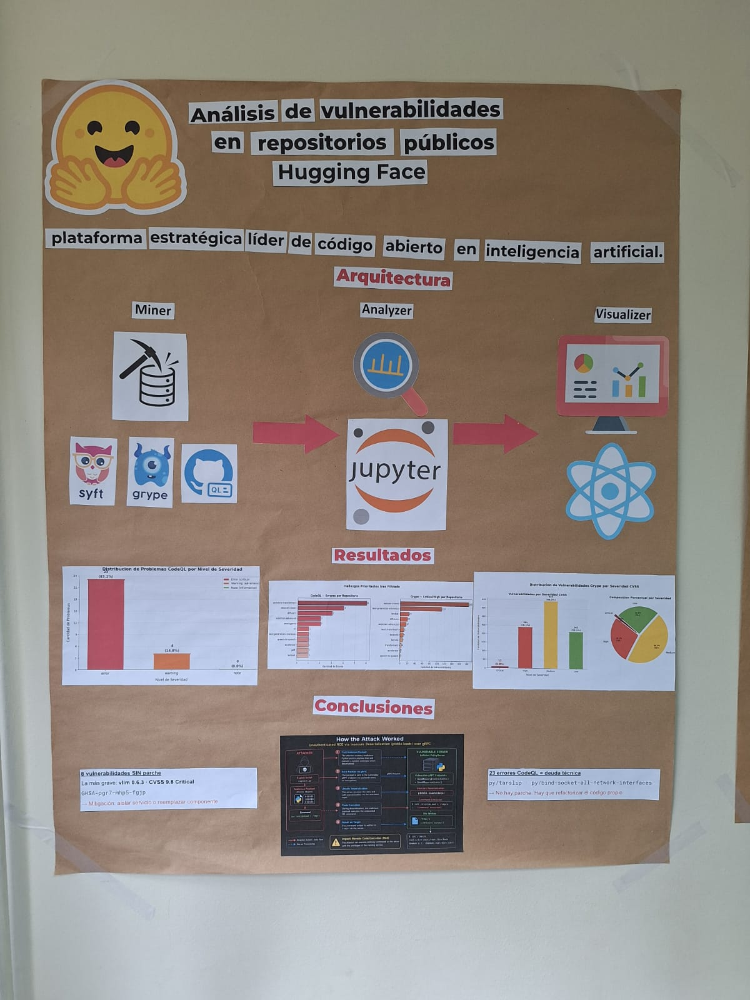

<p align="center">
  
  
  
  
</p>

<h1 align="center">Security Analyzer</h1>

<p align="center">
  <strong>Pipeline automatizado de analisis de seguridad para repositorios de codigo abierto</strong><br/>
  Miner &rarr; Analyzer &rarr; Visualizer
</p>

<p align="center">
  <em>Proyecto desarrollado para el curso de Ciberseguridad (ICC610) — 2026</em>
</p>

---

## Descripcion General

**Security Analyzer** automatiza el analisis de seguridad de repositorios de GitHub mediante un pipeline de tres etapas:

- **Miner** — clona repositorios, genera inventarios de dependencias (SBOM), detecta CVEs con Grype y analiza el codigo fuente con CodeQL. Guarda todos los resultados como JSON en `data/results/`.
- **Analyzer** — notebooks Jupyter que consumen los JSON del Miner para caracterizar vulnerabilidades, identificar patrones y generar visualizaciones estadisticas.
- **Visualizer** — dashboard web React que lee `data/results/` directamente y presenta los hallazgos en tiempo real con auto-refresh.

El proyecto se ejecuta dentro de un **Dev Container** de Docker que preinstala todas las herramientas necesarias.

---

## Arquitectura

```
┌─────────────────────┬──────────────────────┬─────────────────────────────┐
│     MINER           │      ANALYZER        │       VISUALIZER            │
│  (Recoleccion)      │  (Procesamiento)     │    (Presentacion)           │
│                     │                      │                             │
│  clone_repos.py     │  01_analisis_        │  React 18 + Vite            │
│  generate_sboms.py  │  vulnerabilidades    │  Recharts + Tailwind        │
│  generate_grype.py  │  .ipynb              │  Auto-refresh (30s)         │
│  generate_codeql.py │                      │                             │
│  generate_reports.py│  Notebooks Jupyter:  │  5 vistas:                  │
│  analyzer.py        │  - Dist. por         │  - Dashboard                │
│                     │    severidad         │  - Repos                    │
│  Salida:            │  - Hallazgos por     │  - CVEs (Grype)             │
│  data/results/      │    repositorio       │  - CodeQL                   │
│  *-sbom.json        │  - Top reglas        │  - SBOM                     │
│  *-grype.json       │  - Top paquetes      │                             │
│  *-codeql.json      │  - Fix availability  │  Acceso:                    │
│  *-summary.json     │                      │  localhost:5173             │
└─────────────────────┴──────────────────────┴─────────────────────────────┘
```

---

## Requisitos Previos

| Requisito | Verificacion |
|---|---|
| **Docker Desktop** | `docker --version` |
| **VS Code** | — |
| **Extension Dev Containers** | Panel de extensiones de VS Code |

> Todas las herramientas de analisis (CodeQL, Grype, Syft, Python 3.11, Node.js, Java) se instalan automaticamente dentro del Dev Container.

---

## Inicio Rapido

### 1. Abrir en Dev Container

```bash
git clone <URL_DEL_REPOSITORIO>
cd "Proyecto-Ciberseguridad"
code .
```

En VS Code: `F1` → **Dev Containers: Reopen in Container** (~5-15 min la primera vez).

### 2. Configurar repositorios

Editar `data/config.json`:

```json
{
    "repositories": [
        "https://github.com/org/repo"
    ]
}
```

### 3. Ejecutar el Miner

**Opcion A — CLI (recomendado):**

```bash
# Pipeline completo: clone → sbom → grype → codeql → report
uv run python main.py all
```

**Opcion B — Notebook:**

Abrir y ejecutar `nbs/00_pipeline_completo.ipynb` desde Jupyter dentro del Dev Container.

### 4. Abrir el Visualizer

```bash
cd visualizer
npm install   # solo la primera vez
npm run dev
# → http://localhost:5173
```

### 5. Ejecutar el Analyzer

Abrir en Jupyter (dentro del Dev Container):

```
nbs/01_analisis_vulnerabilidades.ipynb
```

---

## Stack Tecnologico

### Miner (Python)

| Tecnologia | Uso |
|---|---|
| **Python 3.11** | Lenguaje principal |
| **Click** | CLI |
| **Rich** | Output en terminal |
| **Pandas** | Procesamiento de datos |
| **ThreadPoolExecutor** | Ejecucion paralela |

### Herramientas de Analisis

| Herramienta | Funcion |
|---|---|
| **Syft** | Generacion de SBOM |
| **Grype** | Deteccion de CVEs (NVD, GitHub Advisory, OSV) |
| **CodeQL** | Analisis estatico (Python, JS, Java, C++, C#) |

### Visualizer (Frontend)

| Tecnologia | Uso |
|---|---|
| **React 18** | Framework UI |
| **Vite 5** | Build tool + servidor dev |
| **Recharts** | Graficos interactivos |
| **Tailwind CSS** | Estilos |
| **Lucide React** | Iconos |


## Imagen del poster



## Licencia

Proyecto academico — Ciberseguridad (ICC610) — 2026.
